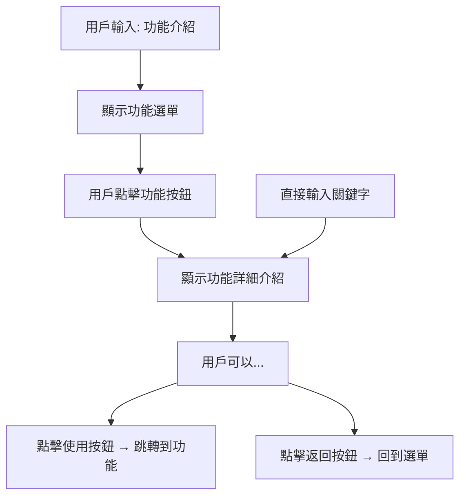

# 🎯 TourHub Line Bot 功能選單系統

## 📋 概述

新的功能介紹系統採用**方案一：功能選單 + 詳細介紹**的設計，提供更好的用戶體驗：

- ✅ 互動式功能選單
- ✅ 詳細的功能介紹頁面
- ✅ 直觀的按鈕導航
- ✅ 支援直接關鍵字查詢

## 🚀 功能特點

### 1. 功能選單
- 用戶輸入「功能介紹」後顯示5個功能按鈕
- 每個按鈕對應一個主要功能
- 清晰的視覺設計和統一的風格

### 2. 詳細介紹頁面
每個功能的詳細頁面包含：
- 📝 功能描述
- ✨ 功能特點列表
- 📋 使用方法步驟
- 🔗 直接使用按鈕
- 🔙 返回選單按鈕

### 3. 多種使用方式
- **選單導航**：功能介紹 → 點擊按鈕 → 查看詳情
- **直接查詢**：直接輸入「排行榜功能介紹」等關鍵字

## 📱 用戶使用流程



## 🎨 支援的功能

### 🏆 排行榜功能
- **關鍵字**: `排行榜功能介紹`、`排行榜說明`、`排行榜怎麼用`
- **特點**: 即時排名、用戶評分、詳細行程、旅行靈感
- **使用**: 查看熱門行程排行榜

### 🗓️ 行程管理功能
- **關鍵字**: `行程管理功能介紹`、`行程管理說明`、`行程管理怎麼用`
- **特點**: 個人行程、靈活安排、隨時修改、多平台同步
- **使用**: 建立和管理個人旅遊行程

### ⏰ 集合管理功能
- **關鍵字**: `集合管理功能介紹`、`集合功能介紹`、`TourClock功能介紹`
- **特點**: 時間地點設定、自動提醒、團體管理、防止走失
- **使用**: 管理團體旅遊的集合時間

### 🛅 置物櫃功能
- **關鍵字**: `置物櫃功能介紹`、`置物櫃說明`、`寄物功能介紹`
- **特點**: 位置定位、空位查詢、價格比較、行李寄存
- **使用**: 尋找附近的置物櫃服務

### 💰 分帳工具功能
- **關鍵字**: `分帳功能介紹`、`分帳說明`、`AA功能介紹`
- **特點**: 支出記錄、自動計算、多人分帳、費用明細
- **使用**: 管理旅行中的共同費用

## 🔧 技術實現

### 配置文件 (config.py)
```python
# 功能選單模板
"feature_menu": {
    "title": "🎯 選擇您想了解的功能",
    "color": "#6C5CE7",
    "description": "點擊下方按鈕查看詳細功能介紹"
}

# 功能詳細介紹模板
"feature_details": {
    "leaderboard": {
        "title": "🏆 排行榜功能",
        "color": "#FF6B6B",
        "description": "查看最受歡迎的旅遊行程排行榜",
        "details": [...],
        "usage_steps": [...],
        "button_text": "立即查看排行榜",
        "url": "https://tourhub-ashy.vercel.app/"
    }
}
```

### Postback 事件處理
```python
# 功能詳細介紹
elif action == 'feature_detail':
    feature = params.get('feature')
    flex_message = create_simple_flex_message(
        "feature_detail",
        feature_name=feature
    )

# 返回功能選單
elif action == 'back_to_menu':
    flex_message = create_simple_flex_message("feature_menu")
```

## 📊 測試結果

✅ **功能選單創建**: 成功創建5個功能按鈕
✅ **詳細介紹頁面**: 所有5個功能的詳細頁面正常
✅ **關鍵字匹配**: 支援直接關鍵字查詢
✅ **Postback 事件**: 按鈕交互正常運作
✅ **返回導航**: 返回選單功能正常

## 🎯 優勢對比

### 舊版本 vs 新版本

| 特點 | 舊版本 | 新版本 |
|------|--------|--------|
| 內容呈現 | 單一大型卡片 | 互動式選單 + 詳細頁面 |
| 用戶體驗 | 資訊密集，難以閱讀 | 分層展示，清晰易懂 |
| 互動性 | 靜態顯示 | 動態按鈕交互 |
| 功能深度 | 簡單描述 | 詳細特點 + 使用步驟 |
| 導航方式 | 無 | 選單導航 + 直接查詢 |
| 手機適配 | 內容過長 | 分頁顯示，適合手機 |

## 🚀 部署說明

1. **配置文件已更新**: `api/config.py`
2. **主程式已更新**: `api/index.py`
3. **測試文件已創建**: `test_new_features.py`
4. **向後兼容**: 舊的「功能介紹」關鍵字仍然有效

## 📞 使用建議

1. **推薦用戶使用新的互動式選單**
2. **保留舊的關鍵字支援以確保兼容性**
3. **可以在歡迎訊息中介紹新功能**
4. **定期更新功能詳細內容以保持資訊準確**

---

**注意**: 此功能已完全實作並測試通過，可以立即部署使用。
