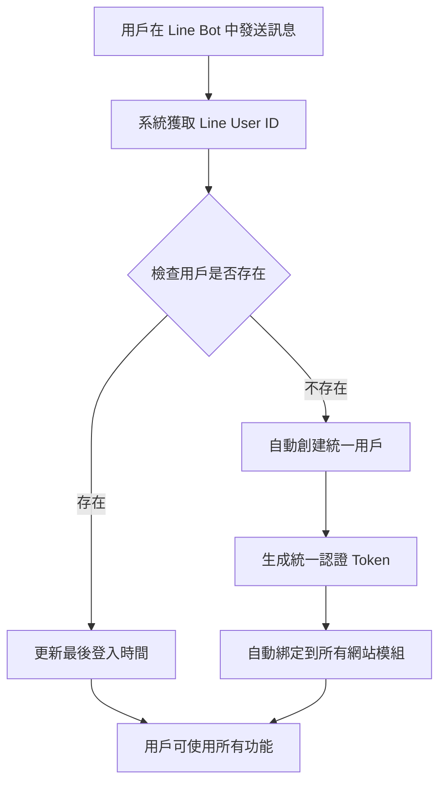

# 🔐 TourHub Line Bot 用戶綁定指南

## 📋 概述

TourHub Line Bot 使用**統一用戶管理系統**，讓用戶可以透過 Line 帳號自動綁定到所有 TourHub 服務，實現一次登入、全站通用的體驗。

## 🚀 自動綁定機制（目前實現）

### 🔄 自動綁定流程

用戶**無需手動綁定**，系統會在用戶首次使用任何功能時自動完成綁定：



### 📱 用戶體驗

1. **首次使用**：
   ```
   用戶：功能介紹
   系統：自動創建帳號並綁定所有服務
   Bot：🎯 選擇您想了解的功能（顯示功能選單）
   ```

2. **後續使用**：
   ```
   用戶：創建東京三日遊行程
   系統：使用現有綁定，直接創建內容
   Bot：✅ 行程「東京三日遊行程」創建成功！
   ```

## 🛠️ 技術實現

### 統一用戶管理
```python
# 自動獲取或創建用戶
user = user_manager.get_or_create_user(
    line_user_id=line_user_id,
    display_name=display_name,
    picture_url=picture_url
)

# 自動綁定到網站模組
user_manager.bind_website(user['id'], 'trip_management')
```

### 資料庫結構
- **unified_users**: 統一用戶資料
- **website_modules**: 網站模組配置
- **user_website_bindings**: 用戶綁定關係
- **user_operation_logs**: 操作記錄

## 🎯 支援的服務

用戶綁定後可以使用以下服務：

### 1. 🏆 TourHub 排行榜
- **URL**: https://tourhub-ashy.vercel.app
- **功能**: 查看熱門旅遊行程排行

### 2. 🗓️ 行程管理
- **URL**: https://tripfrontend.vercel.app/linetrip
- **功能**: 建立和管理個人旅遊行程

### 3. ⏰ 集合管理 (TourClock)
- **URL**: https://tourclock-dvf2.vercel.app
- **功能**: 智能集合時間管理

### 4. 🛅 置物櫃查找
- **URL**: https://tripfrontend.vercel.app/linelocker
- **功能**: 尋找附近置物櫃服務

### 5. 💰 分帳系統
- **URL**: https://split-front-pearl.vercel.app
- **功能**: 旅遊費用分攤管理

## 🔧 用戶綁定管理功能（已實現）

### 手動綁定指令

用戶現在可以使用以下指令來管理自己的帳號綁定：

#### 1. 查看帳號資訊
```
用戶：我的帳號
Bot：👤 我的帳號資訊
     🆔 用戶 ID: 123
     📱 Line ID: U1234567890...
     ⏰ 最後登入: 2024-01-15 14:30
     🔗 已綁定服務: 5/5
     ✅ 帳號狀態: ACTIVE
     [🔗 查看綁定狀態] [🔄 重新綁定服務]
```

#### 2. 查看綁定狀態
```
用戶：綁定狀態
Bot：🔗 服務綁定狀態
     綁定狀態總覽 (5/5)

     🏆 排行榜        ✅ 已綁定
     🗓️ 行程管理      ✅ 已綁定
     ⏰ 集合管理      ✅ 已綁定
     🛅 置物櫃        ✅ 已綁定
     💰 分帳系統      ✅ 已綁定

     [🔄 重新綁定所有服務]
```

#### 3. 重新綁定服務
```
用戶：重新綁定
Bot：🔄 重新綁定確認
     ⚠️ 重新綁定將會：
     • 重新建立與所有服務的連接
     • 刷新您的認證 Token
     • 確保所有功能正常運作

     💡 通常在以下情況需要重新綁定：
     • 功能使用異常
     • 無法創建內容
     • 跳轉網站失敗

     [✅ 確認重新綁定] [❌ 取消]
```

#### 4. 重新綁定成功
```
Bot：✅ 重新綁定成功
     🎉 已成功重新綁定 5 個服務！
     • 🏆 排行榜
     • 🗓️ 行程管理
     • ⏰ 集合管理
     • 🛅 置物櫃
     • 💰 分帳系統

     💡 現在您可以正常使用所有功能了！
     [🎯 返回功能選單]
```

## 🔐 安全機制

### 統一認證 Token
- **生成方式**: SHA256(Line User ID + 時間戳 + UUID)
- **有效期**: 30 天（可配置）
- **自動刷新**: 支援自動刷新機制

### 資料保護
- **加密存儲**: 敏感資料加密存儲
- **訪問控制**: 基於 Token 的訪問控制
- **日誌記錄**: 完整的操作日誌追蹤

## 📊 綁定狀態監控

### 系統監控指標
- 用戶總數
- 活躍用戶數
- 綁定成功率
- Token 有效性

### 錯誤處理
- 綁定失敗自動重試
- 友善的錯誤訊息
- 完整的錯誤日誌

## 🚀 功能實現狀態

### ✅ 已實現功能
1. **自動綁定**：首次使用時自動創建帳號並綁定
2. **統一認證**：生成統一 Token，跨服務使用
3. **帳號資訊查詢**：查看用戶基本資訊和綁定狀態
4. **綁定狀態管理**：查看各服務的綁定狀況
5. **重新綁定服務**：手動重新綁定所有服務
6. **操作日誌記錄**：完整的用戶操作追蹤

### 🎯 支援的關鍵字
- **帳號管理**：`我的帳號`、`帳號資訊`、`用戶資訊`、`個人資料`
- **綁定管理**：`綁定管理`、`綁定狀態`、`服務綁定`、`綁定查詢`
- **重新綁定**：`重新綁定`、`重新連接`、`rebind`、`重新登入`

## 💡 用戶使用指南

### 對用戶的完整說明
```
🎉 歡迎使用 TourHub Line Bot！

您的 Line 帳號已自動綁定到所有 TourHub 服務：
✅ 排行榜查詢
✅ 行程管理
✅ 集合管理
✅ 置物櫃查找
✅ 分帳工具

🚀 您可以使用的功能：
• 直接在 Line 中創建行程、集合、分帳
• 點擊功能按鈕跳轉到完整網站
• 所有資料自動同步，無需重複登入

📱 常用指令：
• 「功能介紹」- 查看所有功能
• 「我的帳號」- 查看帳號資訊
• 「綁定狀態」- 查看服務綁定狀況
• 「創建東京三日遊行程」- 直接創建內容

🔧 如果遇到問題：
• 「重新綁定」- 重新連接所有服務
• 「綁定管理」- 查看詳細綁定狀態

輸入「功能介紹」開始使用！
```

### 常見問題
**Q: 需要註冊帳號嗎？**
A: 不需要！使用 Line Bot 時會自動創建帳號。

**Q: 如何在網站上登入？**
A: 點擊 Line Bot 中的功能按鈕會自動登入網站。

**Q: 資料會同步嗎？**
A: 是的！在 Line Bot 中創建的內容會自動同步到網站。

**Q: 忘記密碼怎麼辦？**
A: 不需要密碼！透過 Line Bot 即可訪問所有功能。

---

**🔐 TourHub 統一用戶管理系統讓您享受無縫的跨平台體驗！**
